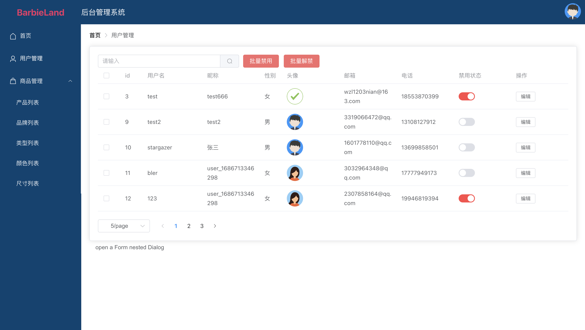

# 后台管理系统
### **VUE3 + VITE + Element-plus + Pinia + Axios + Echarts + VUE-Echarts + SCSS + TypeScript + VUE-Router**
- ```npm run dev```运行
- ```npm run build```打包
- [接口地址](http://150.158.18.90:30002/swagger-ui.html?urls.primaryName=beApis#/%E7%94%A8%E6%88%B7%E7%AE%A1%E7%90%86%E6%8E%A5%E5%8F%A3/updateUserByIdUsingPUT)
### 功能
* 登录页面
* 首页：导航栏、header、管理员数据、折线图、饼图、柱状图
* 用户信息展示、搜索、用户增删减查、用户信息编辑、翻页查询用户信息




